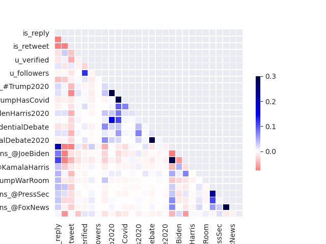
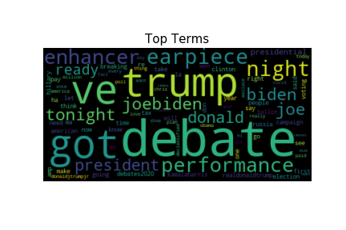
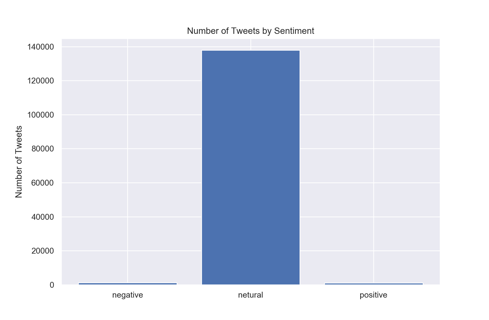
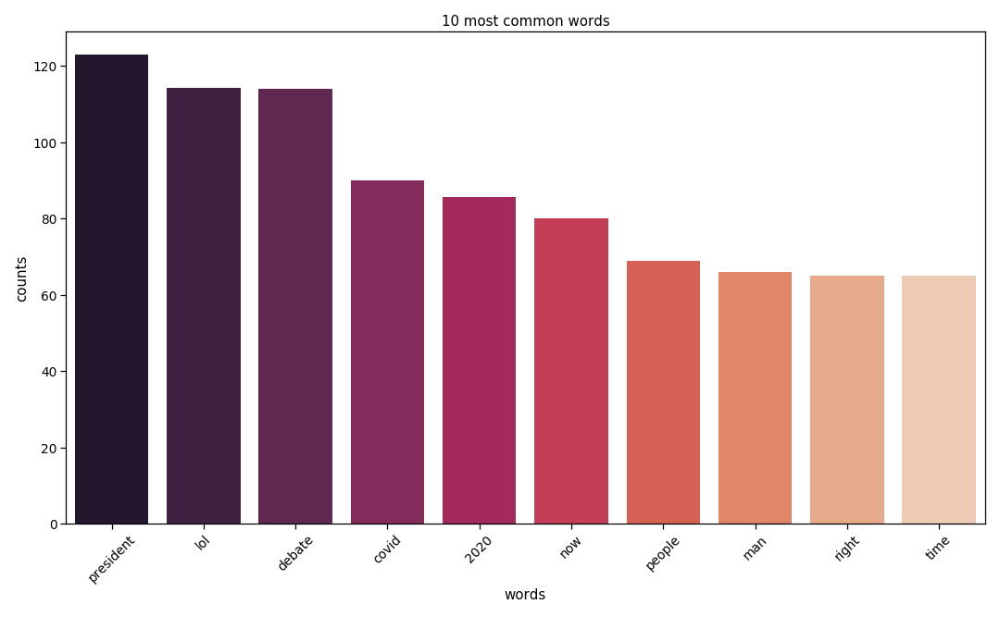
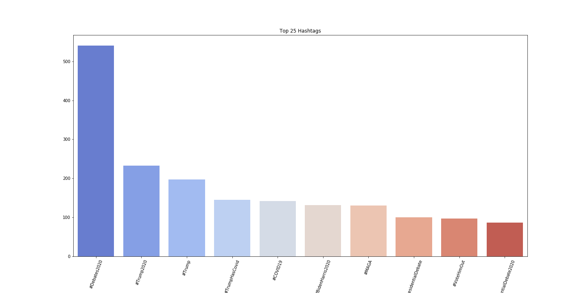
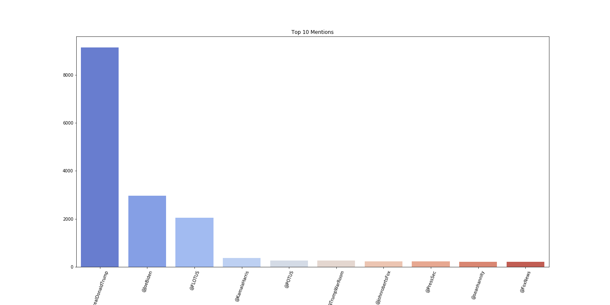
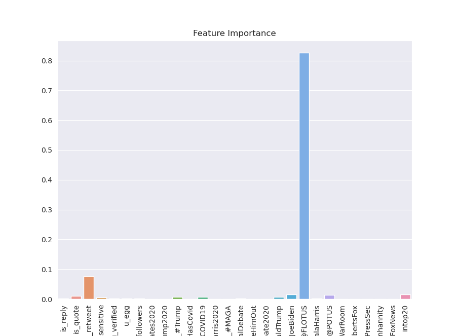

# How to get attention from political twitter
Galvanize Datathon October 30th, 2020 

CJ Holcomb, Heather Berginc, Molly Hardy 

## Background

As part of the Galvanize inaugural Datathon, we were invited to produce a working model and business case using Twitter api data, just prior to the election. The dataset includes three days of tweets from high quality twitter accounts [explanation of this?] from 30 September 2020 to 2 October 2020, three days immediately after the first Presidential Debate.

### Business Case

Political Twitter is a volatile, energetic, engaging mess of a conversation on a good day. Directly after a presidential debate will only make the energy rise further. Additionally, Twitter itself has risen to become one of the most popular social media platforms in the world, and is a critical component of social media presence, as well as personal and professional brand management, news organizations, nonprofits, journalists, comedians, podcasters, artists, actors, political operatives, candidates for office, and academics are all trying to raise their profile by engaging with political content on Twitter, and with this project we will attempt to model how a user might capitalize on political events to get more engagement on their tweets. 

*   Imagine you are new to Twitter and you are trying to build up the engagement on your account. You are really interested in what is happening right now with the 2020 Election (sidenote, who isn’t?) and you want to contribute to the conversation. What is the best way to do that? Who should you be mentioning, retweeting and what words get the most action?

## Data

In addition to the Twitter data provided by Galvanize, we also made use of the first presidential debate transcripts.

### Sources

Instructions for obtaining Twitter data used in this project:

*   Data Source: [GitHub Repo link provided @12PM Friday 10/29/2020]
1. Clone [GitHub Repo link provided @12PM Friday 10/29/2020]
2. Follow the instructions in the repository to install twarc and tqdm.
3. Apply for a twitter developer account.
4. Save api key, save api secret key, save bearer token.
5. Enter your twitter api information into twarc.
6. Use a mv command to move the contents of the desired days into a new single directory.
7. Look inside the cloned repository for the appropriate .txt files containing tweet ids. (ex. cat * >> file name.txt)
8. Concatenate those files into one file.
9. In the terminal, use awk 'NR % 100 == 0' &lt;file.txt> > &lt;result.txt> to systematically sample every 100th tweet id. These are the tweets you will hydrate.
10. Modify the hydrate.py script in the cloned repository and run the script to rehydrate tweets from your file of tweet ids.
11. Analyze tweets.

We reference [this website](https://us.trend-calendar.com/trend/2020-10-02.html) in our video referring to the top trending words on Twitter for October 2nd, 2020.

Instructions for obtaining debate transcript:

The debate transcript can be [found here]([https://www.rev.com/blog/transcripts/donald-trump-joe-biden-1st-presidential-debate-transcript-2020](https://www.rev.com/blog/transcripts/donald-trump-joe-biden-1st-presidential-debate-transcript-2020))

The data was organized manually. To replicate:

1. Copy the full debate transcript into a .txt file.
2. Replace blocks of text indicating a new speaker (including the timestamp) with [‘,’]
3. Add square brackets to the beginning and end of the file.
4. You should now have a list file that can serve as a corpus.

Exploratory Data Analysis

After the initial import of the large data set, we realized that this json file consisted of 140,000 tweets and over 370 columns. Parsing the columns revealed several key categories:

1. Content of the tweet (e.g. full tweet text, user mentions, hashtags)
2. Tweet metadata (e.g. reply/quote/retweet, time)
3. User information (e.g. usernames, profile fields, follower count)
4. Content and metadata of retweeted/quoted tweets

Given we were interested in the effect the debate had on twitter engagement, we decided early on that the features directly from the dataset would be limited to the most relevant, and spend more time working with natural language processing.

Before diving into the NLP, we took a look at some of the features that might affect retweets and favorites. Simply noting the length of a tweet, could we determine if there was any correlation? The visual below highlights that tweets over 304 characters seem to have no correlation to an increase in favorites, this is the start of our interest in predicting the engagement with our twitter data.

Moving into the actual language of the text, we note the following word cloud highlights the top terms mentioned in the twitter text.

As our goal was to model how to increase Twitter engagement, we decided to choose two variables as our targets- the number of retweets each tweet received, and the number of favorites (likes) it received, using these as a proxy for Twitter engagement. Disappointingly, number of replies and number of views were not available in this dataset (or anywhere on the Twitter api).

For potential expansion of the project, we also retained the user and tweet metadata associated with tweets quoted and retweeted. If quoting/retweeting proves to have high feature importance, we would retain the ability to drill further down and see what tweets increase engagement when quoted/retweeted.

We also wanted to supplement our feature set with some derived features. They come from three sources:

Sentiment analysis of the tweet text.

Identify the top 20 words in the transcript and count how many of those words appeared in the tweet.

Hashtags/user mentions used in the tweet text.

Please see the data dictionary [here](link) for a breakdown of all variables

### Sentiment Analysis Explanation

We knew we wanted to bring in sentiment analysis to this dataset. With many different choices available to use for sentiment analysis we needed to find something that could use our unlabeled text and classify each Tweet as positive, neutral, or negative. We decided to use the [VADER]([[https://github.com/cjhutto/vaderSentiment](https://github.com/cjhutto/vaderSentiment)) library. VADER stands for Valence Aware Dictionary for sEntiment Reasoning (they really forced the E to work there) and is specifically tuned for social media expressions.

What makes VADER special is its ability to use text sentiment and be sensitive to both polarity and intensity of emotion in text. It is able to recognize that “happy” has a different meaning than when it is paired with “not” and it can also understand the emphasis of capitalization in words and differentiate “LOVE” from “love” in its final score of that word.

Each tweet is given a percentage of being “negative” “neutral” or “positive” we identified the highest percentage as the “final label” of the tweets sentiment label and analyzed those results.

It is very interesting to see that the majority of our tweets are falling into the “neutral” category. With additional time we would have explored the “compound” number which is a normalized score of the tweet. That may be a better representation of sentiment for our tweet.

### Debate Transcript Topic Mining

To determine the effect of the debate on twitter engagement, we attempted to process the debate transcript and draw out latent topics.

Producing the corpus as described above, we had individual “speeches” (speech between questions/interruptions/allotted time expiring) as 790 documents. We removed stop words and lemmatized the text before tokenizing and vectorizing it, and then used KMeans clustering to derive clusters. Without specifying a number of clusters, the model produced 8, which is what we decided to initially explore.

Using the TFIDF vectorizer, we found the top terms that hold the most weight across tweets.

This avenue of inquiry has been put aside for now, as time does not permit us to complete these features before the closing of the Datathon.

### Hashtags/Mentions

Looping through the text data, we were able to gather the top 10 hashtags and mentions used within the three day period after the election. The idea was to one hot encode this information to see if using these top ten hashtags and the top ten tags led to more retweets than those twitter texts that did not mention those top options. The visual below shows the top ten hashtags and the top ten mentions which were features thrown into our final model. 

## Model

### Evaluation Metric

As our goal here is to provide guidance for someone looking to increase their Twitter engagement, we decided to use Explained Variance as our model evaluation metric. This does run the risk of our model having higher bias, and we debated additional metrics, but ultimately we value reducing the uncertainty in behavior effects geared toward increasing engagement.

### Baseline Models

We used seven different regressor model types as our baseline (Linear Regression, K Neighbors, Decision Tree, Random Forest, Gradient Boost, Support Vector, and XGBoost.)

Linear Regression and SVR did not perform well, but all the other 5 had Explained Variance/r2 scores above .7, and three above .8. The winner was XGBoost, which came in above .85.

### Model Tuning

As time is not a plentiful resource for the Datathon, using gridsearch, a highly processor-intensive and time-consuming task. We did do some model tuning on our XGBoost model, and after two rounds of using GridSearchCV, we brought our r2 up to .875. Additional tuning could improve this, however it will need to be undertaken after the Datathon is completed.

### Feature Importance

Far and away the most important feature was the mention of @FLOTUS, the official twitter account of First Lady Melliana Trump. This may or may not have to do with the President and First Lady's COVID Diagnosis. 

## Conclusion

While political events such as debates are much anticipated and months in the making, an unexpected event can surpass the Twitter footprint of even an important electoral event like this. Coninciding with her COVID diagnosis, FLOTUS because the 7th- largest trending topic on twitter on Oct 2nd (COVID was 5), and our model shows that was by far the best predicitor of a tweet recieving more retweets (and therefore attention) than any other factor.

This particular model suggests that an effective strategy to increase engagement is to inolve and mention a person at the center of a big story. Though the President was also diagnosed, he has a far greater Twitter footprint than she.

## Next Steps

*   We would like to dive deeper into the Sentiment Analysis and tokenize the words found in “positive” tweets vs “negative tweets.” We were curious about the fact that 98% of our tweets were falling into the “neutral” category. Due to the opacity of the Vader library, however, we don’t have much insight into exactly what defines positive/negative/neutral.
*   We would like to complete the cosine difference between the debate transcript and the tweet text, and add those features to our model.
*   Some more time and energy can be spent on hyperparameter tuning our model, and we may want to also tune our Gradient Boost & K Nearest Neighbors models.
*   We would also like to add three days worth of tweets *before* the debate, to measure any shifts and topics/engagement

# Appendix: .py Files Explanations

The following files are meant to be accessed in order.

1. columns_wrangling.py - This file soley exists to store large lists and dictionaries that are referenced in several files. It greatly cuts down on repeat work, and allows updates to be centralized.

2. dataset_construction.py - This file contains the code and functions to clean the raw dataset and reduce the features and targets into what is reuiqred for our model. The funcitons here solely produce the scalar features & targets, though other files that convert text fields into one-hot or sentiment features. The code also saves json files into the data folder, to prevent needing to run such an expensive block of code.

3. sentiment.py - This file computes the sentiment scores for each tweet. It is referenced in dataset_construction

4. heather_funcs.py - This file parses both the hashtags and mentions and converts the tops ones into one-hot encoding.

5. text_vector.py - Ununsed in final model/analysis. Used to vecotrize both tweet content and debate transcript. Will be used in a future version for a more thoughout textual analysis and comparison.

6. model_tester.py - contains functions to instantiate, fit, test

**VIDEO:**
[Video Link](https://drive.google.com/file/d/1M-mhdJOQZxhvJx3R9u-rKgHw36sVw6Uk/view?usp=sharing)

*   Business problem
*   Sentiment and text vectorization 
*   Features for model
*   Model performance